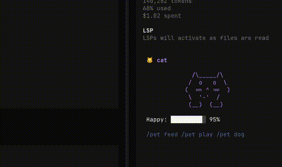

<!-- markdownlint-disable MD041 -->
<div align="center">

# campy

[](https://opensource.org/licenses/MIT)

Animated terminal pets for OpenCode and Claude Code.

[Features](#features) • [Installation](#installation) • [Slash Commands](#slash-commands)

</div>

## Demo



## Overview

campy brings delightful ASCII pets to your terminal sidebar. Pets animate through states, react to coding events, and display contextual speech bubbles—adding personality to your coding sessions.

## Features

- **4 Pet Types**: Cat, Hamster, Ghost, and Robot
- **7 Animation States**: idle, happy, sleeping, eating, playing, excited, sad—with multi-frame animations and blinking
- **Speech Bubbles**: Context-aware messages ("Edited file!", "Thinking...", "Need a hand?")
- **Happiness System**: Feed, play, or pet your companion to increase happiness
- **Event Reactions**: Automatic responses to tool use, file edits, errors, and idle states
- **Slash Commands**: `/pet feed`, `/pet play`, `/pet robot`, and more
- **Claude Code Support**: Standalone ghost-pet plugin for Claude Code with hooks

## Installation

### OpenCode

```bash
# Copy the .opencode/ directory into your project
cp -r .opencode/ /path/to/your/project/

# Restart OpenCode—the pet appears in the sidebar
```

### Claude Code

```bash
# Copy the ghost-pet/ directory
cp -r ghost-pet/ /path/to/your/project/ghost-pet

# Run with the plugin
claude --plugin-dir ./ghost-pet

# Use slash commands
/ghost-pet:ghost        # Check on your ghost
/ghost-pet:ghost-feed   # Feed (+15 happiness)
/ghost-pet:ghost-play   # Play (+20 happiness)
/ghost-pet:ghost-pet   # Pet (+10 happiness)
```

The ghost automatically reacts:
- Successful tool use → ghost gets happy
- Tool failure → ghost gets sad

## Slash Commands

| Command | Effect |
|---------|--------|
| `/pet feed` | Feed your pet (+15 happiness) |
| `/pet play` | Play with your pet (+20 happiness) |
| `/pet pet` | Pet your pet (+10 happiness) |
| `/pet sleep` | Put pet to sleep |
| `/pet wake` | Wake pet |
| `/pet status` | Show mood & happiness |
| `/pet cat` | Switch to cat |
| `/pet hamster` | Switch to hamster |
| `/pet ghost` | Switch to ghost |
| `/pet robot` | Switch to robot |

## Available Pets

| Pet | States | Blinking | Emoji |
|-----|--------|----------|-------|
| Cat | 7 states | Yes (layered eyes) | 🐱 |
| Hamster | 7 states | Yes (frame-step) | 🐹 |
| Ghost | 7 states | Yes (layered eyes) | 👻 |
| Robot | 7 states | Yes (layered eyes) | 🤖 |

## File Structure

```
.opencode/
├── plugins/
│   └── pets.tsx              # Main OpenCode plugin
└── tui.json                  # Plugin configuration

ghost-pet/
├── .claude-plugin/
│   └── plugin.json            # Claude Code manifest
├── commands/                  # Slash commands
├── ghost-pet.sh              # State machine + renderer
└── hooks/                  # Event hooks
```

## License

[MIT](LICENSE)